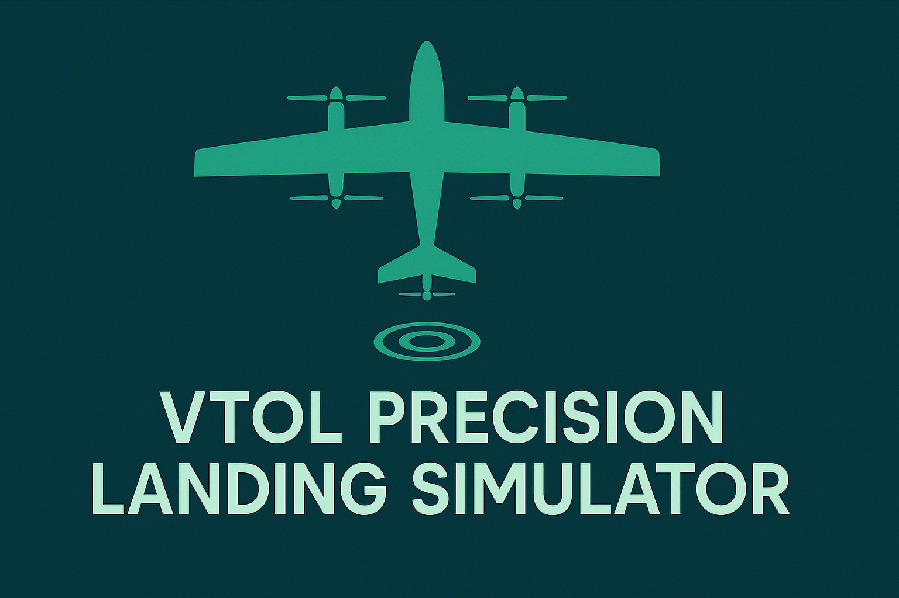

**Streamlit app** for simulating **precision eVTOL/Hybrid VTOL landings** in confined spaces using RTK GNSS, lidar, and vision targets.  


---

## ✨ Features (at a glance)

- **UAV dropdown** (all VTOL): Vector, Trinity F90+, WingtraOne Gen II, DeltaQuad Evo, Sentaero VTOL, Marlyn Cobalt, ALTI Transition, Percepto Air Max, Urban Hawk (custom).
- **Scenario presets**: Rooftop Urban, Ship Deck, Forest Clearing, Desert Pad, Warehouse Doorway → **Apply Preset**.
- **Vision assist**: ArUco / AprilTag; printable ArUco PNG; pixel–altitude model; **lock threshold (px)** & **dwell (frames)**; sliders for **illumination**, **blur**, **occlusion**.
- **RTK vs GPS**: toggle RTK; optional **wind gust** and **GPS glitch**.
- **Lidar vs Barometer**: compare Z accuracy; remove baro drift near touchdown.
- **Kalman filter (CV)**: dynamic R (tighter when vision-locked) + optional **beacon gain** toward pad.
- **3D Landing Cone**: 2D allowed-radius ring + lightweight 3D wireframe trace.
- **Landing Playback**: single in-place animation; live status (🔴/🟡/🟢), px estimate, detection probability, dwell, σ.
- **Metrics & Score**: XY touchdown error, vertical speed, cone violations, final-segment lock stability → **0–100 score**.
- **Auto-Tuner**: random search over beacon gain, lock px/dwell, KF q/R; multi-seed averaging; **Apply Best Settings ▶️**.
- **Run Log Export**: **CSV** (full trace), **JSON** (settings + metrics), **ZIP** bundle.
🕹️ How to use
	1.	Select UAV and optionally a Scenario Preset → Apply Preset.
	2.	Adjust vision, marker size, camera HFOV/res, lock px/dwell, illum/blur/occlusion, RTK/lidar, wind/glitch.
	3.	Click Run Playback → watch 2D/3D cone, lock state, and metrics.
	4.	Check Landing Success Score and download logs.
	5.	Open Auto-Tuner, run trials → Apply Best Settings ▶️ → re-run.

⸻

📊 Scoring (0–100)
	•	XY error (goal ≤ 0.20 m)
	•	Vertical speed at touchdown (goal ≤ 0.5 m/s)
	•	Cone violation rate
	•	Lock stability (final 30%)

Weights implemented in landing_score().

⸻

📤 Run Log Export
	•	CSV: per-frame x_raw,y_raw,x_kf,y_kf,z_agl,detected,locked,px_est.
	•	JSON: app version, run UUID/time, UAV/specs, all parameters, metrics, preview.
	•	ZIP: trace.csv, runlog.json, settings_only.json.

---

## 🚀 Quickstart

```bash
git clone https://github.com/<you>/vtol-precision-landing-simulator.git
cd vtol-precision-landing-simulator
python -m venv .venv && source .venv/bin/activate   # Windows: .venv\Scripts\activate
pip install -r requirements.txt
streamlit run vtol_precision_landing_app.py
